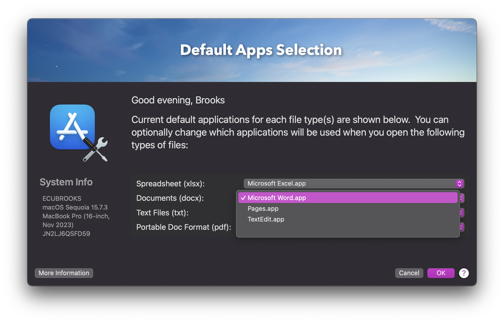
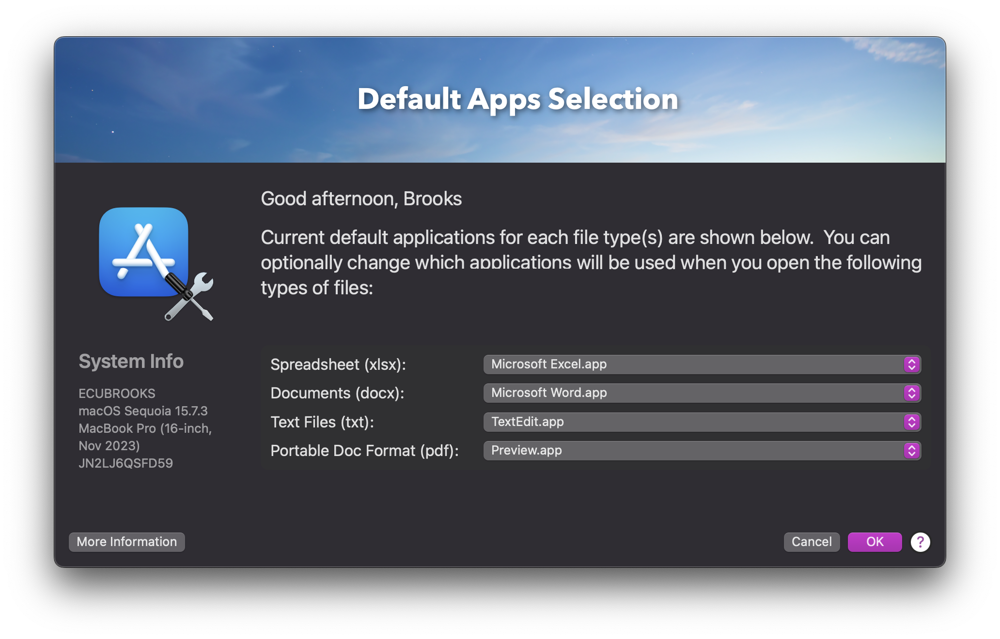
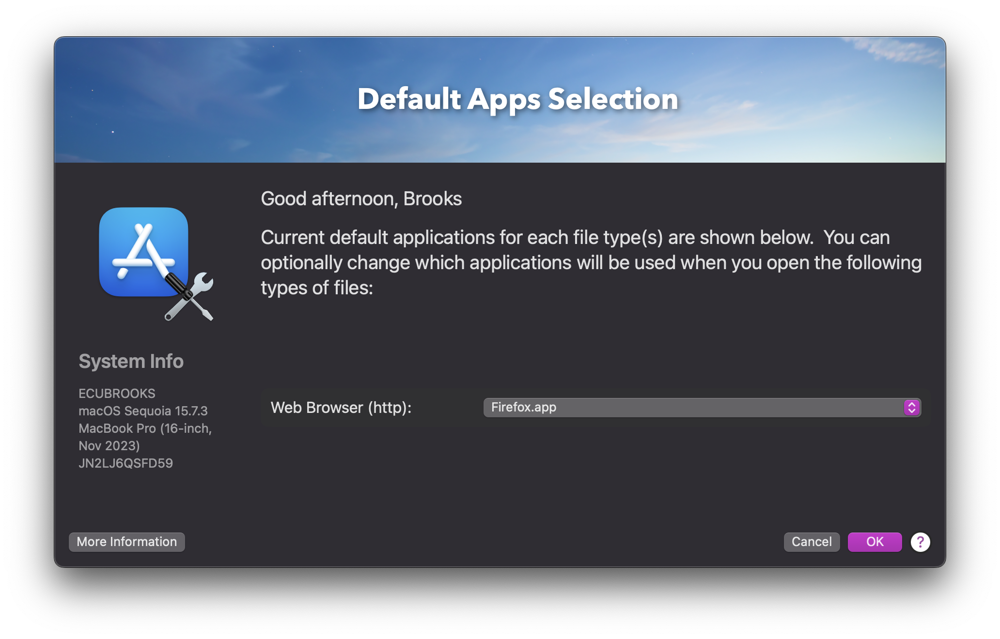

# SetDefaultApps (swiftDialog + utiluti)

A Jamf-friendly **Self Service UI** for letting end users choose default applications for common:
- URL schemes (e.g. `https`, `mailto`, `pdf`)
- File extensions / types (e.g. `https`, `mailto`, `pdf`, `ftp`, `docx`, `xlsx`, `txt`, `md`)

The script builds a **swiftDialog** window with dropdown(s) and applies the selections using **utiluti**.

## Credits / Background

This project is based on Scott E. Kendall’s original “SetDefaultApps” script from his Jamf Pro Scripts collection.

The original implementation established the core workflow: using swiftDialog to collect user selections and relying on Jamf policies (via manually entered triggers) to install required dependencies and support files.

This repository is a fork of that work. The primary changes focus on how default apps are selected and applied through an updated method that allows administrators to choose which UTIs and URL schemes are presented to the end user. This allows a more flexible configurations and support for multiple presets.

All credit for the original concept and structure belongs to Scott E. Kendall

This script focuses on:
- Parameter-driven configuration (presets or custom lists)
- Easier rebranding and support for different environments

Original repository (SetDefaultApps folder): [ScottEKendall/JAMF-Pro-Scripts.](https://github.com/ScottEKendall/JAMF-Pro-Scripts/tree/main/SetDefaultApps)

---

## Screenshots

### Custom Selection (Multiple Types)


### Document Preset


### Web / Browser Preset


---

## Requirements

### Dependencies
- **swiftDialog** (required)
- **utiluti** (required)

[utiluti](https://github.com/scriptingosx/utiluti) supports setting defaults for URL schemes and UTIs via CLI. 

### Jamf Pro
Designed to run as a Jamf Pro Script from a Policy (commonly via Self Service).
The script uses Jamf policy triggers to install/update swiftDialog and utiluti when missing.

---

## Jamf Script Parameters (4–9)

| Parameter | Purpose | Example |
|---|---|---|
| `$4` | Preset name OR comma-separated list of types | `browser-only` or `https,mailto,pdf,docx` |
| `$5` | swiftDialog binary path | `/usr/local/bin/dialog` |
| `$6` | Jamf policy trigger to install/update swiftDialog | `installswiftDialog` |
| `$7` | Jamf policy trigger to install utiluti | `install_utiluti` |
| `$8` | Jamf policy trigger to install support files (optional) | `install_support` |
| `$9` | Support URL (Help button / QR code) | `https://support.example.com` |

---

## Presets (Parameter 4)

### `browser-only`
Shows browser selection (commonly `https`).

### `email-only`
Shows only `mailto`.

### `docs-only`
Shows common document types: `pdf`, `docx`, `xlsx`, `txt` (and optionally `md` if added).

### Custom list
Provide a comma-separated list:
- URL schemes: `https,mailto,ftp`
- File extensions/types: `pdf,docx,xlsx,txt,md`

Example:
```text
https,mailto,pdf,docx,xlsx,txt,md
